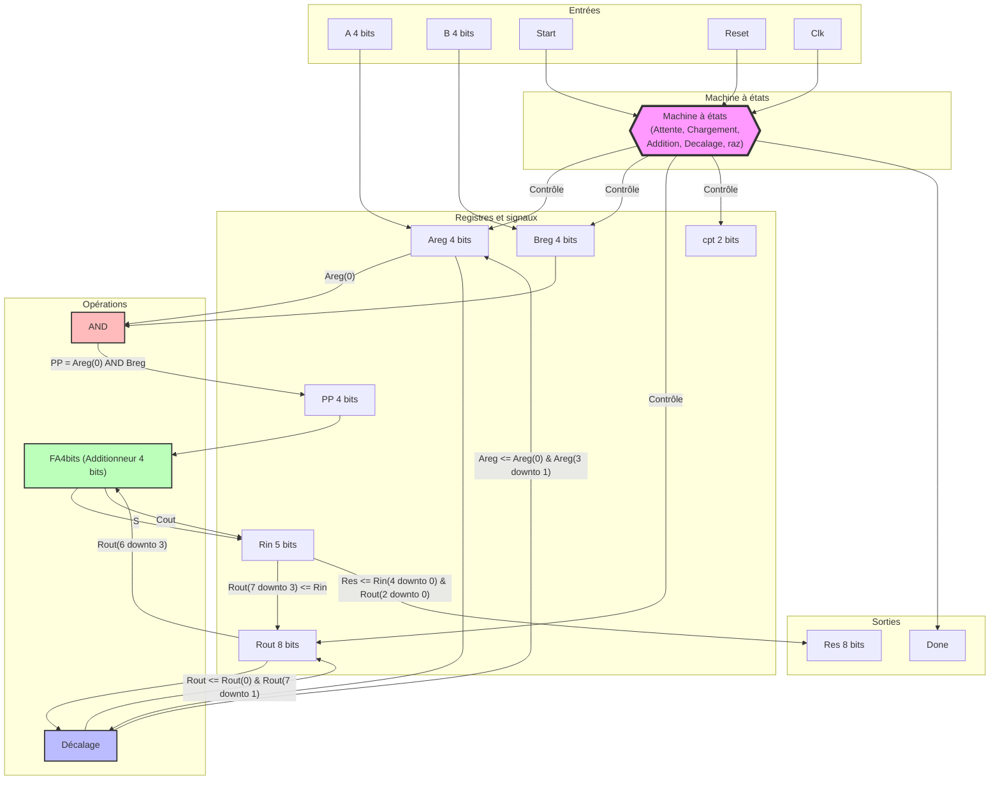
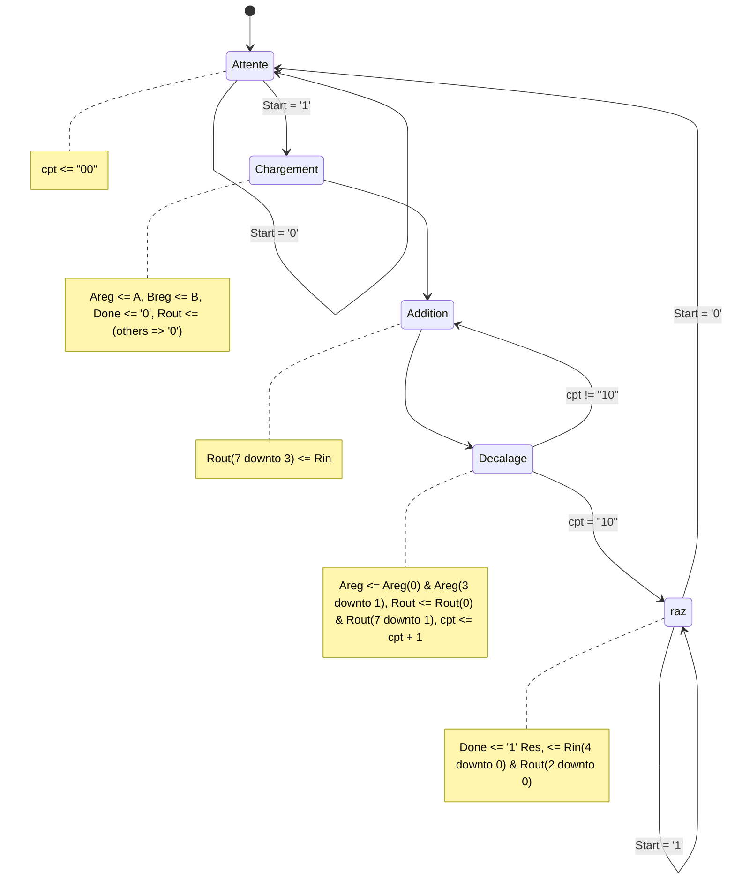
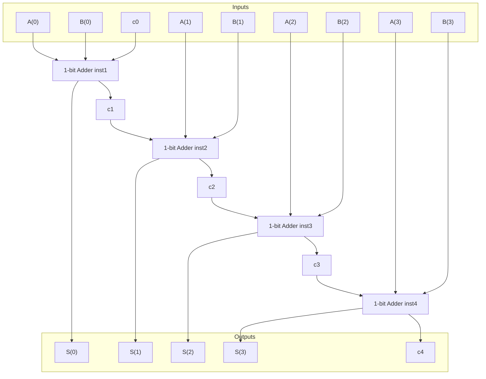

# 4-bit VHDL Multiplier Project

This repository contains the VHDL implementation of a 4-bit multiplier and its components. The project is structured in a hierarchical manner, with the multiplier using a 4-bit full adder, which in turn uses a 1-bit adder.

It decomposes the multiplication operation into 4 additions
```math
A\times B = a_{3} a_{2} a_{1} a_{0} \times b_{3} b_{2} b_{1} b_{0} \Leftrightarrow 
\begin{align} \hline
& & & & & a_{0}b_{3} & a_{0}b_{2} & a_{0}b_{1} & a_{0}b_{0} \\
 & & & + & a_{1}b_{3} &  a_{1}b_{2} & a_{1}b_{1} & a_{1}b_{0} & 0 \\
 & & + &  a_{2}b_{3} & a_{2}b_{2} & a_{2}b_{1} & a_{2}b_{0} & 0 & 0 \\ 
 & + & a_{3}b_{3} & a_{3}b_{2} & a_{3}b_{1} & a_{3}b_{0} & 0 & 0 & 0 \\
& \text{\small carry }\swarrow  &   \downarrow & \downarrow & \downarrow & \downarrow & \downarrow & \downarrow & \downarrow \\
 & p_{7} & p_{6} & p_{5} & p_{4} & p_{3} & p_{2} & p_{1} & p_{0} \\

\end{align}
```


The overall architecture of the multiplier is specified in the following diagram



## Components

### 1. 4-bit Multiplier

The 4-bit multiplier is the top-level component that performs multiplication of two 4-bit numbers.



#### Functionality

- Implements the shift-and-add algorithm for multiplication.
- Uses a finite state machine (FSM) to control the multiplication process.
- Utilizes a 4-bit full adder for partial product addition.

#### Implementation Details

- **Data Flow**: 
  - Partial product (PP) calculation using bitwise AND operations.
  - Result assembly from intermediate results.
- **Instantiation**: 
  - Instantiates the 4-bit Full Adder (FA4bits) for adding partial products.
- **Process**: 
  - A single process implements the FSM, controlling the multiplication steps.
  - The FSM has states: Attente (Wait), Chargement (Load), Addition, Decalage (Shift), and raz (Reset).

#### Signals

- Input: A, B (4-bit operands), Start, Reset, Clk
- Output: Res (8-bit result), Done
- Internal: Areg, Breg, PP, Rin, Rout, cpt (counter)

### 2. 4-bit Full Adder (FA4bits)

The 4-bit full adder is used within the multiplier to add partial products.



#### Functionality

- Adds two 4-bit numbers and a carry input.
- Produces a 4-bit sum and a carry output.

#### Implementation Details

- **Instantiation**: 
  - Instantiates four 1-bit adders (TP1) to create the 4-bit adder.

#### Signals

- Input: A, B (4-bit addends), c0 (carry in)
- Output: S (4-bit sum), c4 (carry out)
- Internal: c1, c2, c3 (intermediate carries)

### 3. 1-bit Adder

The 1-bit adder is the basic building block used in the 4-bit full adder.

The equations are

```
s <= a XOR b XOR cin;
cout <= (a AND b) OR (a AND cin) OR (b AND cin);
```

#### Functionality

- Adds two 1-bit inputs and a carry input.
- Produces a 1-bit sum and a carry output.

#### Implementation Details

- **Data Flow**: 
  - Uses concurrent signal assignments to calculate sum and carry.

#### Signals

- Input: a, b (1-bit addends), cin (carry in)
- Output: s (sum), cout (carry out)


